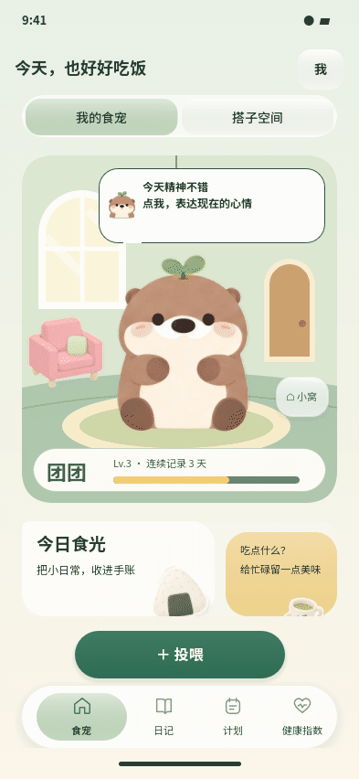
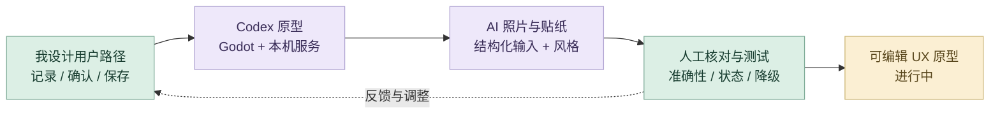
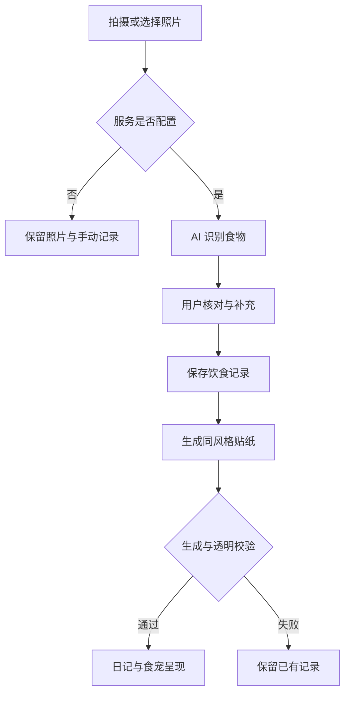

# 饭搭子

饮食记录、食宠与 AI 照片工作流的 UX 原型，进行中。

**[完整设计案例](https://xiongzhiyuan-portfolio.pages.dev/zh/works/?project=fandazi) · [求职作品总入口](https://github.com/Zhiyuan-Xiong/xiongzhiyuan-portfolio)**

## 项目目标

项目进行中。完成后补充问题定义、用户流程与原型。

## 我的贡献

用户体验、界面与原型设计；整理 AI 照片记录工作流。

**项目进行中。** 本仓库展示现有设计与可编辑原型；完整商业产品、真实共享服务与付费 AI 质量尚待继续验证。

## 我的 AI 策略与迭代工作流

把 AI 放进可理解、可核对、失败后仍能继续的产品流程。AI 负责照片理解与插画生成，我负责用户路径、确认机制、视觉风格和状态体验。项目进行中。

### 从灵感到交付

| 阶段 | AI 策略与我的判断 |
| --- | --- |
| **1. 围绕真实使用场景发散** | 从饮食记录、食宠互动与搭子关系展开方案，比较拍照、手动记录和日记反馈如何形成持续使用动机。AI 对话帮助展开方案；产品方向和优先级由我组织。 |
| **2. 整理路径与约束** | 将记录、确认、保存、回看和食宠反馈拆成明确步骤。区分照片识别、用户补充与保存记录，并考虑未配置服务、生成失败等状态。 |
| **3. Figma 建立交互与视觉基准** | 在 Figma 中组织页面与组件状态，定义插画风格和内容层级。食物贴纸参考已有插画，让生成视觉服务统一的产品体验。 |
| **4. Codex 搭建 Godot 原型** | 把用户路径连接成 Godot 页面、状态与可编辑数据，配合本机 Python AI 服务。保留设计图层、场景、脚本和服务代码，让流程能够继续迭代。 |
| **5. AI 照片识别与人工核对** | 将照片、补充信息和结构化约束传入识别流程。用户确认食物和份量后再保存，避免把自动识别的结果直接当成最终记录。 |
| **6. 同风格贴纸与状态验证** | 以餐食照片为内容、Figma 插画为风格，生成透明 PNG。检查透明通道、图像状态、视觉一致性以及识别与生成等待时的交互反馈。 |
| **7. 用失败路径推动迭代** | 未配置密钥时仍可保存照片；生成失败保留已有记录。将实际问题反馈到提示词、数据结构或交互路径，优先保证用户能理解当前状态并继续使用。 |
| **8. 记录当前原型范围** | 交付 Godot 原型、本机服务、页面与动效预览。目前真实付费 AI 的端到端质量、外部共享与完整产品体验仍在继续验证。 |

### 审美、专业制作与质量控制

| 质量维度 | 我如何控制 | 可查看产出 |
| --- | --- | --- |
| **用户可控** | 核对食物与份量、允许补充信息，再保存记录。 | 确认与修正入口 |
| **视觉精良** | 用已有插画作为风格基准，检查真实透明通道与结果状态。 | 产品内一致的食物贴纸 |
| **体验连续** | 识别或生成失败时保留照片和已有记录，说明当前状态。 | 可继续使用的降级路径 |

### 反馈如何改变下一步

### 工具分工

Figma 组织界面与状态；Codex 连接 Godot 原型、本机 Python 服务与结构化数据；AI 照片流程负责识别与贴纸生成；用户和设计者保留核对与修改入口。

**过程证据：** [Figma 设计与状态](prototype/design/) · [Godot 页面与状态逻辑](prototype/scripts/) · [本机 AI 服务](prototype/ai_service/) · [实际页面与动效](previews/)

[阅读详细工作流与提示词组织方法](工作流.md) · [我的完整 AI 设计方法](https://github.com/Zhiyuan-Xiong/xiongzhiyuan-portfolio/blob/main/docs/AI设计工作流.md)

## 仓库内容

| 内容 | 入口 |
| --- | --- |
| Figma 图层与 Godot 原型 | [prototype/design/](prototype/design/)、[prototype/scenes/](prototype/scenes/) |
| 交互与状态代码 | [prototype/scripts/](prototype/scripts/) |
| AI 服务与结构化数据 | [prototype/ai_service/](prototype/ai_service/) |
| 页面与动效预览 | [previews/](previews/) |

## 运行与范围

用 Godot 4.7.2 导入 `prototype/project.godot`。AI 服务使用本机 Python，依赖见 `prototype/ai_service/requirements.txt`，启动程序见 `prototype/ai_service/start.ps1`。真实 AI 使用需要使用者自己的配置，密钥与个人照片不随仓库发布。

照片估算需人工核对；原型中的示例数据和实际照片记录流程应分别理解。模型权限、端到端质量和外部共享仍待验证。

## 署名与使用

作品素材用于个人设计展示。协作项目以案例中的职责说明为准；字体、引擎和第三方资料遵循各自授权。未经许可，不将作品素材用于转载或商业用途。
