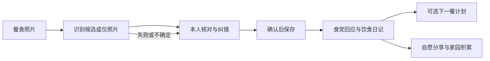
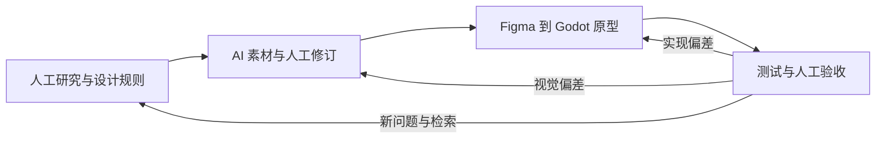

[English](README_EN.md) · [个人作品集](https://xiongzhiyuan-portfolio.pages.dev/zh/work/fandazi/) · [Figma 原型](https://www.figma.com/proto/8wHrD1MYzrA92DJrc4D467/FanDazi?node-id=165-958&starting-point-node-id=165%3A958) · [在线试玩](https://zhiyuan-xiong.github.io/fandazi/)

# 饭搭子计划 · Food Companion

**食宠陪伴式饮食记录 App｜独立 UX / 产品设计与交互原型**


让一餐记录得到回应，也让用户始终保有选择。我将餐食输入、本人核对、食宠回应与饮食日记组织为完整个人体验，再通过自愿分享连接熟人陪伴与家园积累。

| 我的角色 | 工作范围 | 实际工具 |
|---|---|---|
| 独立 UX / 产品设计 | 研究组织、产品策略、信息架构、交互与视觉、AI 辅助素材、原型开发与验证 | Figma、ChatGPT / 图像生成、Codex、Godot、Python；独立 Blender 角色资产归档 |

本仓库提供设计过程、可编辑工程与验证证据；[作品集](https://xiongzhiyuan-portfolio.pages.dev/zh/work/fandazi/)侧重 UX 叙事与完整视觉。当前为设计探索与交互原型，尚未作为正式 App 发布。

## 01 · 研究与设计策略

| 体验断点 | 设计回应 |
|---|---|
| 重复填写，记录成本较高 | 以照片开始，允许只保存照片；识别结果先核对再记录 |
| 营养数字较难感知 | 把回应连回具体餐食，明确估算、假设与未知 |
| 真实变化与反馈较慢 | 为完成记录提供温和回应、可回顾日记和可选空间积累 |

自有行为探针覆盖 **20 人、10 组（5 对好友、5 对情侣）、三周**。归档记载 9/10 组在观察期内持续分享餐食；缺少逐日原始记录、频次阈值与对照组，不能解释为 App 留存率或健康改善。竞品调研提示照片记录、营养管理和养成已有多种实践，因此差异化聚焦于可解释回应与自愿熟人关心，而非宣称功能空白。

四项策略：**轻量记录、看懂依据、温和回应、自愿共养**。它们是需要真实使用验证的设计假设。行业资料与项目样本分开标注，详见[研究依据与限制](docs/research.md)。

## 02 · 核心交互



<table><tr><td></td><td></td><td></td><td></td></tr><tr><td>餐食输入</td><td>本人确认</td><td>日记与贴纸</td><td>双人陪伴设计</td></tr></table>

以上为 Figma 设计导出。个人记录不以邀请好友为前提；双方独立确认记录，未分享不等于没吃。家园提供家具领取、拖动、缩放、层次调整、保存与取消；当前领取天数与伙伴之家使用同机模拟。完整 [63 个 UI 索引](screenshots/ui/README.md)包含页面、弹层和状态，不代表 63 项已实现功能。

## 03 · AI 辅助设计与开发工作流

**我负责方向、规则和审美，AI 协助生成与实现，结果通过人工比较和测试收敛。** 首轮用完整文本交代问题、目标、边界、参考与验收要求；后续用精准短指令定位局部偏差，在保留既有上下文的基础上逐轮修正。以下是精选证据，不公开完整私人对话。



### A · Human-Led Design

我将三个体验断点组织为记录、理解、关系三层结构，规定“确认才记录、未知不填零、分享由本人选择”。在视觉上保留水獭轮廓与识别特征，统一奶油色、低饱和绿、图像比例与透明边缘。AI 提议需要与这些规则核对后才进入产品。

### B · AI-Assisted Asset Production

真实提示词记录明确了 `#527B64 / #CFDCC6 / #DDEAF0`、平面风格和透明背景。局部反馈进一步统一“深绿色实心竖椭圆眼，无眼白、高光、睫毛”，同时保留构图与色彩。

<table><tr><td></td><td></td></tr><tr><td>初始输出</td><td>定向修订后的资产</td></tr></table>

证据：[v8 原始提示词](workflow/evidence/assets_v8-prompts.json)、[v11 贴纸风格约束](workflow/evidence/assets_v11-prompts.json)。人工工作包括选择、比较、提出局部修订与接入验收；不把所有生成图都当成最终资产。

### C · Figma → Codex → Godot

用 Figma 定义视觉与状态，通过 Codex 辅助拆分场景、复用组件和脚本；我核对输入、确认、保存与返回是否符合产品规则。工程保留原始资源名称和引用关系。

<table><tr><td></td><td></td></tr><tr><td>Figma · 165:1257</td><td>Godot · 实际运行截图，使用演示素材</td></tr></table>

例如，[food_flow.gd](godot-demo/scripts/food_flow.gd)按已有记录 ID 更新，写入成功后才更新内存与跳转；[room_canvas.gd](godot-demo/scripts/room_canvas.gd)负责拖动、缩放与布置操作。Figma 到 Godot 的转译包含实现调整，并非逐像素或全部新版功能已同步。

### D · Iteration & Validation

| 需要控制的问题 | 实现与检查证据 |
|---|---|
| AI 不可用时仍能记录，不能伪造营养 | `photo_only`、导入/保存/重载检查 |
| 编辑一条记录不应重复累计 | 同 ID 过滤替换与重复编辑检查 |
| 布置草稿不覆盖已保存空间 | 草稿与持久化分开；布局保存/重载检查，32 件家具纹理检查 |

完整的阶段输入、具体操作、输出、回退条件与精选反馈见 [AI Workflow](workflow/README.md)。49 项归档核心检查与 11 项服务单元测试已在本次仓库副本重跑；不把数量当作用户体验改善或真实 AI 质量的证明。

## 04 · 技术实现

| 模块 | 实际职责 |
|---|---|
| `scripts/main.gd`、`surface.gd` | 55 个场景的路由、返回栈、弹层与原生 Control 排版 |
| `food_view.gd`、`food_summary.gd` | 照片导入、标题/餐次/份量修改、核对与回执 |
| `food_flow.gd` | 本地记录、同 ID 更新、今天/7 天已记录餐食汇总、服务请求 |
| `room_studio.gd`、`room_editor.gd`、`room_canvas.gd` | 32 件家具、领取模拟、My/Partner 两个本地布局与编辑 |
| `ai_service/server.py` | 本机回环接口、鉴权、照片规范化、识别/贴纸请求与结果校验 |

验证版本为 **Godot 4.7.2 / Compatibility**，393 × 852 设计视口，Python 3.10+ 与 Pillow 用于可选本机服务。照片支持 JPG/PNG/WebP，≤12 MB、≤2400 万像素，最长边缩到 1600。真实相机仍为模拟入口。

桌面数据保存在 `user://food_diary/` 与 `user://room-layout.json`。日记先写临时索引再重命名，同 ID 替换；照片先保存，仍可能留下孤立文件，因此不称为完整数据库事务。汇总只覆盖已记录餐食；食宠表达不是健康诊断。

本机 AI 服务需使用者自行配置，只有主动识别或生成时才向外部服务发送照片。公开 Web 版本禁用 AI 服务和密钥设置。服务单元测试使用模拟传输，真实识别质量、营养估算与贴纸质量未验证。详见[技术说明](docs/technical.md)与[运行指南](docs/running.md)。

## 05 · 原型与演示

<table><tr><td></td><td></td><td></td></tr><tr><td>实际运行 · 食宠</td><td>实际运行 · 照片日记</td><td>实际运行 · 空间布置</td></tr></table>

[演示入口与范围](demo/README.md) · [原有食宠动态 GIF](demo/otter-home.gif) · [克隆与本地运行](docs/running.md)

App 原始界面保留中文，中英文文档使用同一组图像。演示使用样例资产；示例营养值明确标注，不计入真实记录。

## 06 · 成果与下一步

| 当前成果 | 边界与下一步 |
|---|---|
| 63 个 Figma UI 导出 | 最新 11 页健康/共同计划设计未进入 Godot；缺少可离线编辑的 `.fig` 文件 |
| 55 个 Godot 场景、457 条目标检查 | 52 个页面/弹层与 3 个组件状态；不是全部逐页人工验收 |
| 本地照片、日记、汇总与家园编辑 | 需要真实设备、无障碍和数据恢复验证 |
| AI 资产生产与可选服务代码 | 制作流程有素材与提示词证据；App 内 AI 效果仍待真实调用验证 |
| 自愿双人陪伴设计 | 无生产账号、云端同步、真实通知或双方协作后端 |

下一步优先验证回应是否被正确理解、陪伴是否形成压力、奖励是否支持持续参与，再迭代新版界面与跨用户规则。[本次验证报告](docs/validation.md)列出实际通过项与未覆盖项。

## 07 · 仓库与授权

```text
fandazi/
├── README.md / README_EN.md
├── PROJECT_HANDOFF.md
├── godot-demo/          # 可编辑工程、资源、可选服务与测试
├── docs/               # 研究、架构、运行、验证、证据与发布范围
├── workflow/           # AI 工作流与精选真实提示词
├── assets/previews/    # 角色、食物、家具精选展示
├── screenshots/        # 63 个 UI 索引、运行与前后对照
└── demo/               # 实际 GIF 与 Web 演示文件
```

完整约 1.10 GB 归档留在本地。没有上传私人研究对话、未匿名化数据、第三方角色参考、重复 SVG/PNG 导出、旧 Windows 安装包和 Blender 源工程。见[文件范围](docs/publication-scope.md)、[资源来源索引](docs/evidence/asset-provenance.json)及[项目交接](PROJECT_HANDOFF.md)。

代码和原创视觉资产均保留作者权利，未自行套用 MIT、CC0 或自由商用授权；第三方字体按 SIL OFL 单列。水獭角色的公开展示与随原型分发已由作者确认，详见 [RIGHTS.md](RIGHTS.md)。[GitHub 主页](https://github.com/Zhiyuan-Xiong)。
