[简体中文](README.md) · [Portfolio case study](https://xiongzhiyuan-portfolio.pages.dev/en/work/fandazi/) · [Figma prototype](https://www.figma.com/proto/8wHrD1MYzrA92DJrc4D467/FanDazi?node-id=165-958&starting-point-node-id=165%3A958) · [Open Web prototype](https://zhiyuan-xiong.github.io/fandazi/)

# 饭搭子 · Food Companion

**A pet-companion meal diary | Independent UX / Product Design & Interactive Prototyping**

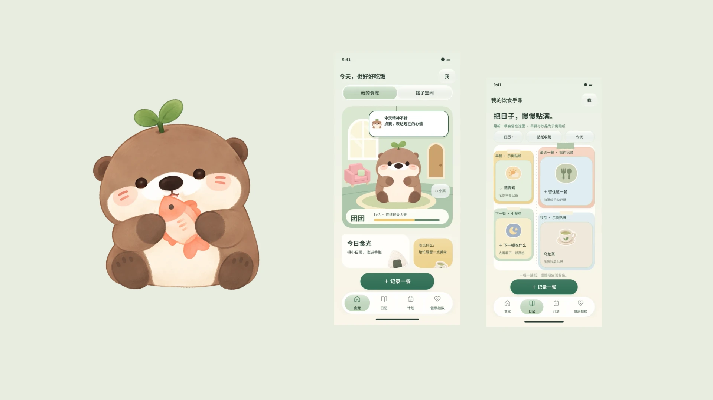

Make a meal entry feel acknowledged while keeping the user in control. I connect meal capture, personal review, a companion’s response, and diary reflection into a complete individual experience. Optional sharing extends this into care between people who know each other and a shared sense of home.

| My role | Scope | Tools used |
|---|---|---|
| Independent UX / Product Designer | Research synthesis, strategy, information architecture, interaction and visual design, AI-assisted assets, prototyping and validation | Figma, ChatGPT / image generation, Codex, Godot, Python; separate Blender character archive |

This repository provides process and implementation evidence. The [portfolio](https://xiongzhiyuan-portfolio.pages.dev/en/work/fandazi/) presents the UX narrative and fuller visual case study. This is a design exploration and interactive prototype, not a released production app.

## 01 · Research & Design Strategy

| Experience gap | Design response |
|---|---|
| Repeated entry creates effort | Start with a photo; allow photo-only entries and require review before saving estimates |
| Nutrition numbers are difficult to interpret | Connect responses to specific meals, explaining estimates, assumptions and unknowns |
| Meaningful change takes time | Acknowledge an entry immediately through gentle responses, diary reflection and optional room accumulation |

The project’s three-week behavioural probe involved **20 people in 10 pairs: five friend pairs and five couples**. The archive reports continued meal sharing by 9/10 pairs during observation. Daily raw records, a frequency threshold and a control group are absent; this is neither app retention nor evidence of improved health. Competitor research shows existing approaches to photo logging, nutrition management and progression. The design opportunity therefore concerns understandable feedback and voluntary care between familiar people, rather than an unoccupied feature category.

Four principles guide the concept: **lightweight logging, an understandable basis, gentle responses and voluntary companionship**. These remain hypotheses to evaluate through use. Industry sources and the project sample are kept separate in [research evidence and limitations](docs/research.md).

## 02 · Core Interaction

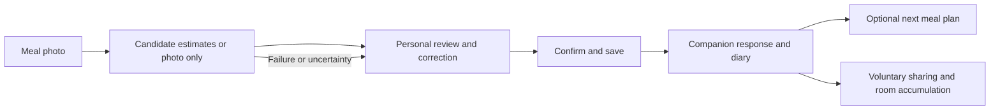

<table><tr><td>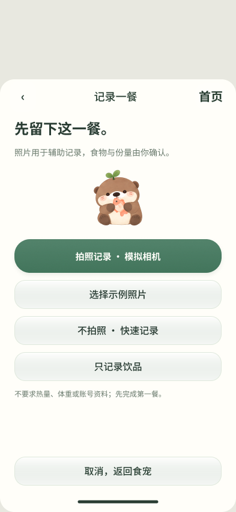</td><td>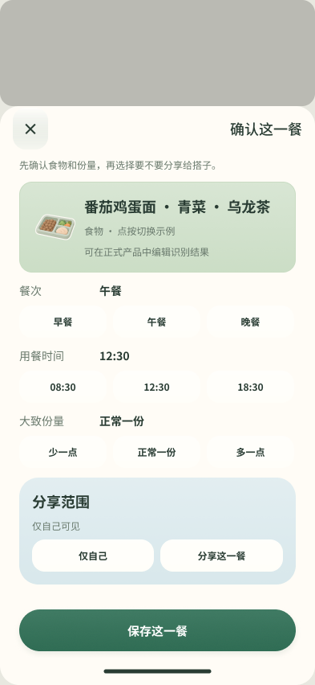</td><td>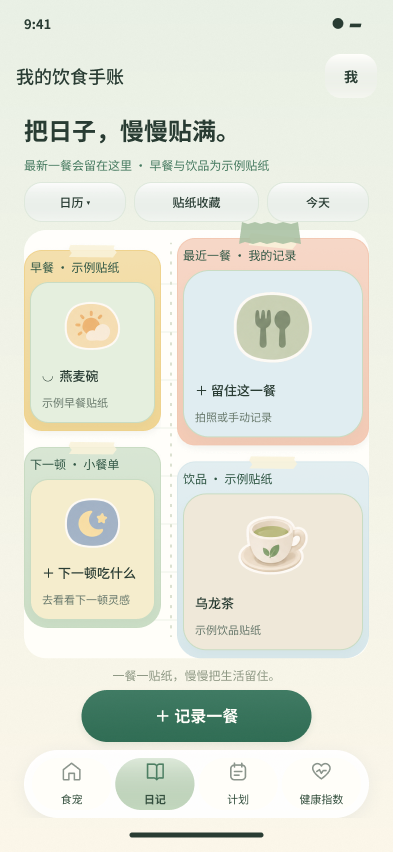</td><td>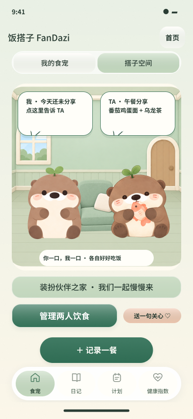</td></tr><tr><td>Meal capture</td><td>Personal confirmation</td><td>Diary and stickers</td><td>Companionship concept</td></tr></table>

These are Figma design exports. Individual logging does not require inviting anyone. Each person confirms their own records; an unshared meal is not a missed meal. Room interactions cover furniture claims, dragging, resizing, layering, save and cancel. Reward days and the partner room are currently simulated on one device. The full [63-frame UI index](screenshots/ui/README.md) includes pages, overlays and states, rather than 63 implemented features.

## 03 · AI-Assisted Design & Development Workflow

**I lead the direction, product rules and aesthetic decisions; AI assists production and implementation, with outputs refined through comparison and testing.** An initial complete brief establishes the problem, goals, boundaries, references and acceptance criteria. Precise short follow-up instructions then target local deviations while retaining context. The repository presents selected evidence, without publishing private conversation histories.

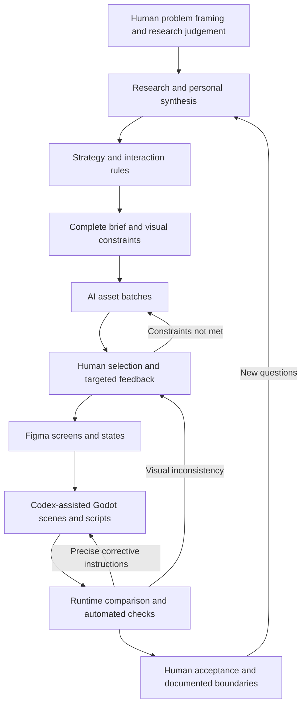

### A · Human-Led Design

I translated the experience gaps into recording, understanding and relationship layers, setting rules such as “confirm before recording”, “unknown is not zero” and “sharing is a personal choice”. I retained the otter’s identifying silhouette and features, and controlled the cream-and-sage palette, proportions and transparent edges. AI suggestions enter the product only after review against these constraints.

### B · AI-Assisted Asset Production

Archived prompts specify `#527B64 / #CFDCC6 / #DDEAF0`, a flat illustration style and transparent backgrounds. Targeted revisions align the eyes as solid dark-green vertical ovals without whites, highlights or lashes, while preserving composition and colour.

<table><tr><td></td><td></td></tr><tr><td>Initial output</td><td>Asset after directed revision</td></tr></table>

Evidence: [original v8 prompts](workflow/evidence/assets_v8-prompts.json) and [v11 sticker constraints](workflow/evidence/assets_v11-prompts.json). My contribution includes selection, comparison, revision direction and integration review. Generated candidates are not automatically accepted as final assets.

### C · Figma → Codex → Godot

Figma establishes the screens and interaction states. Codex assists in translating these into scenes, reusable components and scripts; I check whether input, review, saving and navigation follow the intended rules. Original engine asset names and references are retained.

<table><tr><td></td><td>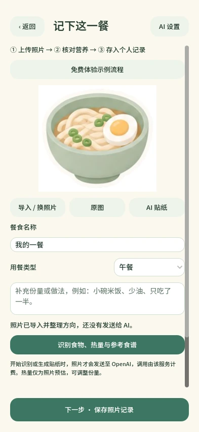</td></tr><tr><td>Figma · 165:1257</td><td>Godot runtime · demonstration artwork</td></tr></table>

For example, [food_flow.gd](godot-demo/scripts/food_flow.gd) updates an existing record by ID and changes memory and navigation only after a successful write. [room_canvas.gd](godot-demo/scripts/room_canvas.gd) implements dragging, resizing and placement. The translation involves implementation adjustments; it is not a claim of pixel-identical output or complete parity with the latest Figma design.

### D · Iteration & Validation

| Problem to control | Implementation and evidence |
|---|---|
| Logging must remain usable without AI; unknown nutrition must stay unknown | `photo_only`, import/save/reload checks |
| Editing an entry must not count it twice | Same-ID replacement and repeated-edit check |
| A room draft must not overwrite the saved layout | Separate draft and persisted states; save/reload and 32 furniture-texture checks |

The [detailed AI workflow](workflow/README.md) records inputs, operations, outputs, return conditions and selected feedback. The archived 49 core checks and 11 service unit tests were rerun in this repository copy. Their counts are not evidence of better UX or live AI quality.

## 04 · Technical Implementation

| Module | Responsibility |
|---|---|
| `scripts/main.gd`, `surface.gd` | Routing, back stack, overlays and native Control layout across 55 scenes |
| `food_view.gd`, `food_summary.gd` | Photo import, title/meal-type/portion editing, review and receipts |
| `food_flow.gd` | Local records, same-ID updates, today/7-day summaries of logged meals and service requests |
| `room_studio.gd`, `room_editor.gd`, `room_canvas.gd` | 32 furniture items, simulated claims, two local My/Partner layouts and editing |
| `ai_service/server.py` | Authenticated loopback API, image normalisation, recognition/sticker requests and response validation |

Validated with **Godot 4.7.2 / Compatibility**, a 393 × 852 design viewport, and Python 3.10+ with Pillow for the optional local service. JPG/PNG/WebP imports are limited to 12 MB and 24 megapixels, downscaled to a 1600-pixel longest edge. Camera capture remains simulated.

Desktop data uses `user://food_diary/` and `user://room-layout.json`. The index is written through a temporary file and renamed, with same-ID replacement. Photos are saved first and orphaned files remain possible; this is not a full transactional database. Summaries cover logged meals only, and character expression is not a health diagnosis.

The desktop AI service requires user configuration. Photos leave the device only on explicit recognition or generation requests. The public Web version disables AI connections and key configuration. Unit tests use mocked transport; live recognition, nutrition estimates and sticker quality remain unverified. See [technical notes](docs/technical.md) and [running instructions](docs/running.md).

## 05 · Prototype & Demo

<table><tr><td>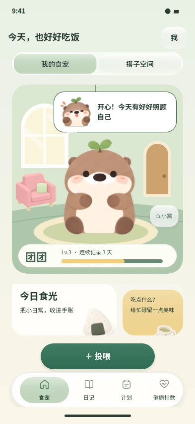</td><td>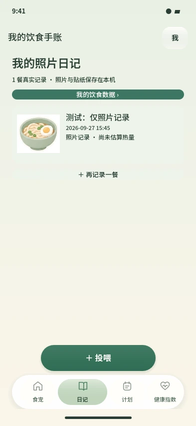</td><td>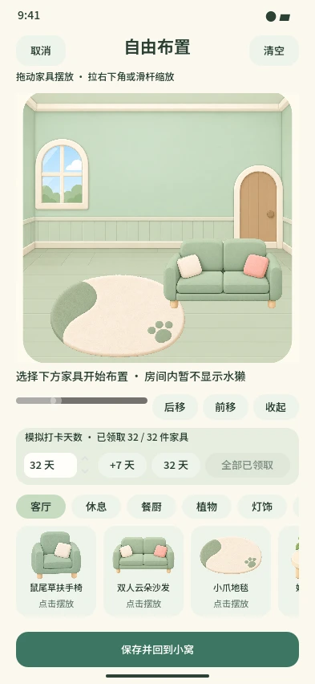</td></tr><tr><td>Runtime · companion</td><td>Runtime · photo diary</td><td>Runtime · room editor</td></tr></table>

[Demo entry and scope](demo/README.md) · [Archived pet animation GIF](demo/otter-home.gif) · [Clone and run locally](docs/running.md)

The original app screens retain Chinese; both README versions use identical visuals. Demos use sample artwork. Example nutrition values are explicitly labelled and excluded from real records.

## 06 · Results & Next Steps

| Current output | Boundary and next step |
|---|---|
| 63 exported Figma UI frames | Eleven latest health/shared-planning frames are not in Godot; no offline-editable `.fig` archive is available |
| 55 Godot scenes; 457 destination checks | 52 pages/overlays and 3 component states; not complete manual acceptance of every screen |
| Local photos, diary, summaries and room editing | Real-device, accessibility and recovery evaluation remain necessary |
| AI asset-production evidence and optional service code | Prompts and assets document production; in-app AI quality still requires live evaluation |
| Voluntary two-person companionship design | No production accounts, cloud sync, real notifications or collaborative backend |

Next, evaluate whether responses are understood, companionship creates pressure, and rewards support continued participation. Then refine the newer screens and cross-user rules. The [validation report](docs/validation.md) distinguishes passed checks from untested areas.

## 07 · Repository & Rights

```text
fandazi/
├── README.md / README_EN.md
├── PROJECT_HANDOFF.md
├── godot-demo/          # Editable project, assets, optional service and tests
├── docs/               # Research, architecture, running, validation and evidence
├── workflow/           # AI workflow and selected original prompts
├── assets/previews/    # Selected character, food and furniture visuals
├── screenshots/        # 63-frame index, runtime and before/after evidence
└── demo/               # Actual GIF and Web demo files
```

The complete ~1.10 GB archive remains local. Private research conversations, non-anonymised data, third-party character references, duplicate SVG/PNG exports, old Windows builds and Blender source files are excluded. See [publication scope](docs/publication-scope.md), [asset provenance](docs/evidence/asset-provenance.json) and [handoff](PROJECT_HANDOFF.md).

Code and original visual assets retain their authors’ rights; no MIT, CC0 or unrestricted commercial licence has been assumed. Third-party fonts are separately licensed under SIL OFL. The author confirmed the otter may be publicly displayed and distributed with the prototype. See [RIGHTS.md](RIGHTS.md). [GitHub profile](https://github.com/Zhiyuan-Xiong).
