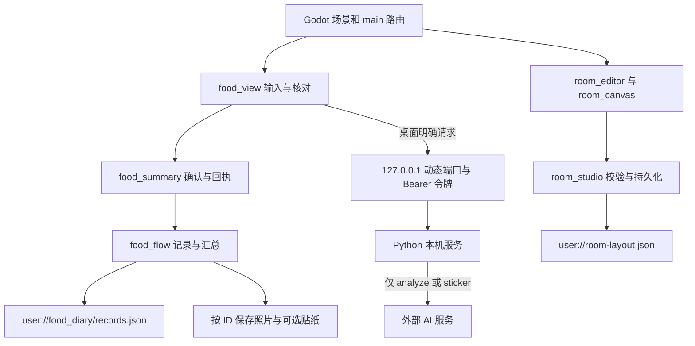

# 技术实现与状态边界

## 工程版本与结构

验证引擎：Godot `4.7.2.stable.official.ed1daf0bf`，Compatibility / GDScript，393×852、canvas_items、keep。`scenes/main.tscn` 为入口，没有生产登录或云端后端。

`assets/figma/` 保留原始哈希文件名，`assets/fonts/` 为 Noto Sans SC 与 OFL。`design/routes.json` 映射 Figma ID→场景，`variables.json` 保留原型状态，`furniture.json` 定义 32 件家具。`scenes/` 共 55 个场景，52 页/弹层与 3 个组件状态。其对应较早 Figma 快照，与最新 63 个导出不同。

## 核心模块

| 文件 | 主要职责 |
|---|---|
| `main.gd` | 路由、返回历史、覆盖层、原型变量、场景/目标 smoke 检查 |
| `surface.gd` / `bottom_navigation.gd` / `drag_scroll.gd` | Control 绘制、四导航、滚动与拖动阈值 |
| `food_view.gd` | JPG/PNG/WebP 导入、标题/餐次/份量输入、识别/贴纸动作与错误保留 |
| `food_summary.gd` | 确认、保存回执、已记录餐食汇总 |
| `food_flow.gd` | 服务请求、本地日记读写、同 ID 更新、页面动态记录 |
| `room_studio.gd` | 拥有/未解锁、模拟天数、领取、布局合法性与持久化 |
| `room_editor.gd` / `room_canvas.gd` | 类别与物件选择、布置草稿、拖动、缩放、层级 |
| `otter_motion.gd` / `home_mood.gd` | 2D PNG 轻动作、心情表达；不是运行 3D 模型 |

## 数据与确认

记录字段包括 id、title、meal_type、created、photo、sticker、notes、meal、planned、source。`photo_only` 表示未估算，`ai_photo_estimate` 为 AI 候选经本人确认后的记录，`demo` 不计入真实汇总。只有确认后 `save_view` 才写入。

餐食索引写 `records.tmp` 后重命名；按 ID 过滤旧条并替换。图片先写，失败时可能留下孤立文件，仍需后续恢复/清理策略。今天/7 天只汇总保存过的餐食，未知单独计数；不能推断全天实际摄入。

份量范围 1–5000g，按相对参考份量换算已有估算，并不重新辨认油量、隐藏食材。逐项食品名称当前仍是 Label。真实拍摄、完整食材自由编辑、删除/云备份/多端冲突未形成生产能力。

My / Partner 是同一设备两个独立布局，不是两个真实账号。初始拥有 2 件，模拟第 32 天可领其余 30 件；天数降低不收回。`room-layout.json` 保存 version/days/owned/rooms，过滤未知/未拥有/重复物件并限制坐标。布局取消丢弃草稿，不撤销奖励领取。

## 本机 AI 服务与边界

Python 服务绑定 `127.0.0.1` 动态端口，通过随机连接令牌验证 Godot 请求。Windows 密钥可由 DPAPI 保存于使用者自己的本机状态目录，或读取进程环境变量。任何真实密钥、bridge/settings 文件都不进仓库。

`/normalize` 仅本机整理方向与图像；`/analyze` 和 `/sticker` 需用户主动触发，才向外部服务发送照片。错误不伪造结果、不无限自动重试。响应校验涵盖数值、非食物、拒绝、截断和透明 Alpha。模型名为归档配置，不代表已验证当前账号权限、价格或效果；首次真实使用需自行核实配置。

公开 Web 适配仅增加浏览器照片选择、入口参数，以及禁用本机 AI 与密钥设置。没有配置后端代理或公用密钥。浏览器保存依赖网站存储，清除数据或隐私模式可能丢失；不作云备份。

## 设计与实现差异

Figma 保存反馈约 2.5 秒自动返回；Godot 照片流程由回执按钮返回。新版 `320:1003–1013` 的感受、共同食谱、历史计划、食材准备和不足状态尚未移植。健康分数/角色状态为设计示例，不存在已验证的医学或健康评分公式。

`tools/build_scenes.py` 等为较早快照的迁移脚本，会重建场景并可能覆盖后续手工迭代；日常运行不执行它们。先在独立分支和备份副本中研究这些脚本。

较早的装扮场景仍有部分静态示例标签（如冻结天数）；动态库存与编辑以自由布置面板为准，后续需统一旧场景文案与实时状态。
