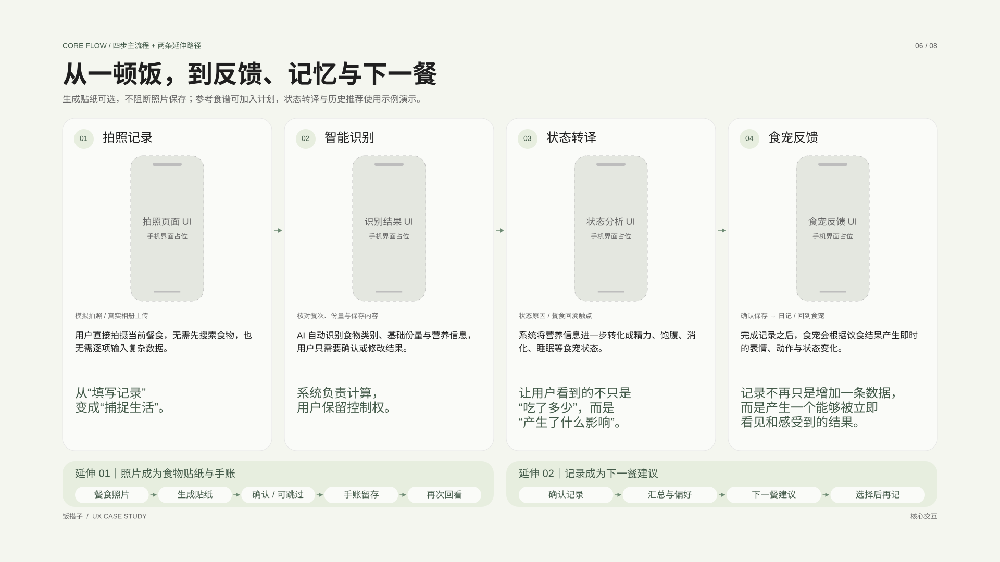

# 饭搭子 · 可编辑 UX 案例框架

以完整设计任务说明生成八页 1920 × 1080 SVG 框架，再结合已有 Figma 视觉参考与 Godot 原型，逐轮修正用户旅程、线性流程图和内容层级。SVG 保留可编辑文本与矢量元素，便于导入 Figma 继续精修。

| 页面 | 可编辑文件 |
| --- | --- |
| 项目总览 | [01_overview.svg](pages/01_overview.svg) |
| 用户观察与研究 | [02_research.svg](pages/02_research.svg) |
| 竞品分析 | [03_competitors.svg](pages/03_competitors.svg) |
| 设计策略 | [04_strategy.svg](pages/04_strategy.svg) |
| 系统与信息结构 | [05_system.svg](pages/05_system.svg) |
| 核心用户流程 | [06_core_flow.svg](pages/06_core_flow.svg) |
| 共同养成 | [07_shared_growth.svg](pages/07_shared_growth.svg) |
| 验证与后续方向 | [08_validation.svg](pages/08_validation.svg) |

[矢量图标](icons/) · [完整工作流](../../工作流.md) · [现有可编辑原型](../../prototype/)

这些页面为中保真案例框架；食物贴纸与手账纳入现有设计方向，饮食模式与下一餐建议仍是待验证的扩展方案。研究整理、设计方案与产品验证分别标注。
