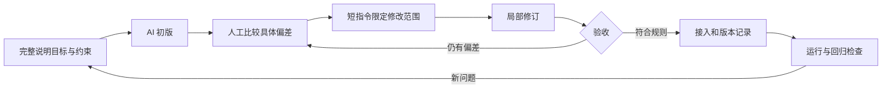

# AI 辅助工作流｜人工定义，定向执行，验证收敛

与个人网站对应的四条主线：Human-Led Design、AI-Assisted Asset Production、Figma → Codex → Godot、Iteration & Validation。

## 可复用的方法与本项目证据

首轮完整任务说明建立上下文：问题、用户、目标、非目标、已有文件、视觉参考、实现边界、输出格式与验收条件。后续不必重复全部背景，而是以短指令明确“改哪里、保留什么、怎样验收”。这是一种在持续上下文中进行的精确设计控制。下表是根据归档组织的方法说明；不是伪造的逐字聊天记录，也不证明每次都严格按相同顺序执行。

| 阶段 | 输入 | 我的具体操作与 AI 的辅助工作 | 输出与进入下一阶段的条件 |
|---|---|---|---|
| 1 灵感与问题发散 | 饮食记录断点、熟人分享情境 | 我判断值得研究的问题；AI 辅助整理候选体验方向，避免直接把养成当答案 | 可追问的问题与候选方向，而非效果结论 |
| 2 多渠道检索 | 项目问题、行业资料、竞品公开介绍 | 用公开资料和归档观察交叉整理；我区分行业样本、自有探针与未实测功能 | 有来源及限制的研究摘要，见研究文档 |
| 3 个人思维组织 | 三个断点、探针线索 | 我组织记录/理解/关系三层、四项原则和范围；AI 辅助归纳表达 | 确认前不入账、未知不写零、自愿分享等可验收规则 |
| 4 AI 辅助方案与规范 | 规则、UI 状态、风格约束 | 完整文本说明目标；我比较方案，规定配色、角色连续性、透明边缘与状态边界 | Figma 页面与生成批次要求；不接受破坏既有角色的简化 |
| 5 分批资产生产 | 场景用途、色值、参考、负向约束 | AI 生成候选；我筛选并以局部短指令修订眼睛、轮廓与风格一致性 | v8 初始/eyes 对照、v11 贴纸约束、选定素材 |
| 6 Codex 原型实现 | Figma 快照、节点 ID、资源、流程和数据规则 | Codex 辅助生成原生场景与脚本；我核对导航、确认、返回、资产引用 | 可编辑 Godot 场景、路由、照片/房间模块 |
| 7 迭代与测试 | 运行偏差、保存失败、重复编辑等问题 | 我指出具体状态偏差；Codex 辅助修改，自动检查与人工对照一起判断 | 49 项核心检查、11 项服务测试及运行截图；失败回到对应模块 |
| 8 回到解释与方案 | 新发现、未验证边界、最新健康旅程 | 重新组织提示词和研究问题；不能用新叙事遮盖尚未实现部分 | 新版 11 页 Figma 提案与下一步验证计划，尚未并入 Godot |

资料检索与个人组织是设计方法的一部分；本仓库没有公开完整聊天和浏览历史，所以不以“完整 AI 使用日志”作为已交付证据。



## 精选证据：把“控制”落在具体产出上

### 1. 视觉风格可以被检查

输入：情境插画用途、真实透明背景、森林绿 `#527B64`、鼠尾草绿 `#CFDCC6`、雾蓝 `#DDEAF0` 与奶油/桃色。AI 输出后，我检查构图、五官、透明边缘和同组一致性。v8 的二轮约束明确眼睛形态；局部调整保留既有构图，避免每轮重新生成导致识别漂移。

| 初始输出 | 局部修订 |
|---|---|
|  |  |

[v8 提示词 JSON](evidence/assets_v8-prompts.json)保留初始与修订记录。[v11 JSON](evidence/assets_v11-prompts.json)另针对贴纸提出平面色块、无深色外轮廓、真实透明边缘、不复制参考文字等约束，说明插画与 UI 贴纸采用不同制作标准。

### 2. 技术转译可以追到文件

| 设计证据 | 实现证据 | 人工判断与边界 |
|---|---|---|
| Figma 165:1257 核对页 | `food_view.gd` / `food_summary.gd` | 标题、餐次、份量可编辑；逐项食物名称仍为 Label，不能称完整食材编辑器 |
| Figma 四主导航与弹层 | `main.gd` / `design/routes.json` | 保留返回与覆盖层语义，记录入口不是第五个 Tab |
| Figma 家具/房间状态 | `room_studio.gd` / `room_canvas.gd` | 同机两布局、草稿与保存分开；不称云端共编 |
| 新版 320:1003–1013 | `screenshots/ui/index.json` | 明确 Figma only，避免宣传与实现混淆 |

真实保存实现摘录（`godot-demo/scripts/food_flow.gd`）：

```gdscript
var updated := records.filter(func(item): return item.id != id)
updated.push_front(saved)
if not write_records(updated): return false
records = updated
last_saved = saved.duplicate(true)
view.record = saved
app.show_page("165:1510" if planned else "165:1308")
return true
```

这段代码使已有 ID 被替换，磁盘写入成功后再改变内存和页面。它不是跨设备事务系统，也未解决所有异常恢复问题。

### 3. 精准反馈的专业表述

以下是根据实际约束重组的反馈示例，不冒充逐字原话：

- **视觉修订：** 保留构图与既有色彩，仅将人物眼睛统一为深绿色实心竖椭圆；去除眼白、高光与睫毛。完成后对照同组插画检查。
- **记录规则：** 在无 AI 结果时允许保存照片，但来源须为 `photo_only`；未知营养不补成零，日记和汇总保持一致。
- **编辑一致性：** 重新保存当前餐食应更新原 ID，不新增第二条记录；重载后仍只计一次。
- **空间编辑：** 将布局草稿与已保存空间分开；取消恢复旧布局，保存后重载一致；不撤销已经领取的家具。

## 结果解释

素材修订证据说明定向审美控制；工程与代码说明实现能力；测试说明限定场景下的行为可重复。三类证据互相补充，不能替代真实用户理解、产品留存、真实 AI 效果或效率提升比例。当前没有可审计的耗时基线，因此不写“效率提升 X%”。

AI 制作工具与 App 内 AI 服务是两层内容：前者用于设计和开发；后者是需要使用者配置、尚待真实验证的产品功能。
