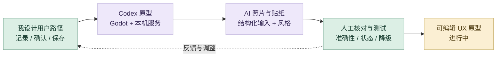
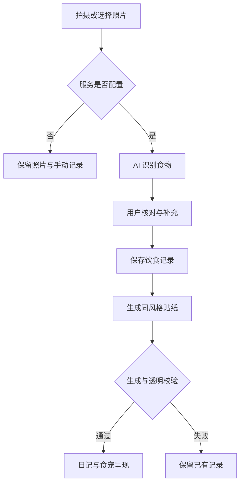

# 饭搭子｜详细 AI 设计工作流

把 AI 放进可理解、可核对、失败后仍能继续的产品流程。AI 负责照片理解与插画生成，我负责用户路径、确认机制、视觉风格和状态体验。项目进行中。

## 策略图

## 工具怎样分工

Figma 组织界面与状态；Codex 连接 Godot 原型、本机 Python 服务与结构化数据；AI 照片流程负责识别与贴纸生成；用户和设计者保留核对与修改入口。

## 指令与任务组织

我先用完整的任务说明建立上下文：交代项目目标、参考资料、审美方向、实现约束、输出格式与验收标准，让 ChatGPT 和 Codex 理解要完成什么。得到初步方案或原型后，我再以精准的短指令逐轮控制修改，明确本轮改什么、保留什么，并对照实际结果继续判断。**完整指令建立方向，短指令控制细节，专业判断决定交付。**

## 八阶段输入与输出

| 阶段 | 输入 | AI 协作与我的控制 | 输出与验收 |
| --- | --- | --- | --- |
| **1. 灵感发散** | 饮食记录、食宠与搭子互动 | Chat 展开记录、反馈与共同养成方向；我确定产品问题与优先级 | 候选方案；聚焦记录与持续互动 |
| **2. 多渠道检索** | 小红书与抖音的使用观察 | Chat 辅助归纳渠道区别和研究表达；我区分知识检索与高频关系互动 | 研究方向；核对实际分享行为 |
| **3. 个人思维组织** | 观察、已有 Figma 和 Godot 原型 | 帮助归纳用户旅程与信息结构；我组织记录、确认、手账与食宠路径 | 产品 brief；区分已有与待验证状态 |
| **4. AI 辅助方案** | 完整页面要求、视觉参考与原型 | Codex 拆分八页 SVG 与交互任务；限定 1920×1080、可编辑文本、栅格和流程图 | 页面框架任务；核对内容与规格 |
| **5. 原型实现** | 页面 brief、原型路径与插画基准 | Codex 生成 SVG、连接 Godot 与本机服务；我审查布局、状态和食物贴纸风格 | 可编辑页面与原型；保持实际流程一致 |
| **6. 迭代与测试** | SVG、原型截图与识别状态 | Codex 按短指令调整流程、图标和内容；我评审层级、人工核对、等待与失败路径 | 新版本；检查布局、状态和保留项 |
| **7. 反馈与再检索** | 流程不清、视觉偏差或新的设计机会 | Chat 梳理表述，Codex 局部修改与检查；明确贴纸手账与下一餐建议的不同成熟度 | 修订方案；用原型和证据决定范围 |
| **8. 精修与交付** | SVG、代码、预览与当前状态 | 整理过程材料与案例说明；我保留人工确认和可继续使用的失败路径 | 进行中的 UX 原型；扩展方案继续验证 |

## 精选迭代：完整规格建立框架，短指令细化体验

最初任务明确八个独立 SVG、1920 × 1080、可编辑文本、栅格、页面结构与中保真范围。随后用已有 Figma 参考与 Godot 原型逐轮控制视觉和流程。以下修改要求依据实际反馈整理。

| 我的反馈 | 精准控制的内容 | 产出与验收 |
| --- | --- | --- |
| 参考已有 Figma，让形式更生动 | 保留内容框架，调整视觉与页面层级 | 八页可编辑 SVG，继续在 Figma 精修 |
| 流程图改为简单的线性结构，保留实际用户路径。 | 将旅程与状态写成清楚的先后步骤 | 用实际原型核对流程，检查布局与边界 |
| 补充食物贴纸、手账与后续饮食建议 | 将新想法放入对应策略与流程页 | 贴纸手账纳入方向；推荐属于待验证扩展 |

[查看八页 SVG 与矢量图标](process/ux-layout/)。研究中，小红书侧重知识检索；抖音续火花／养小火人的观察用于探讨关系互动与重复分享。

## 审美与专业质量

| 质量维度 | 我如何控制 | 可查看产出 |
| --- | --- | --- |
| **用户可控** | 核对食物与份量、允许补充信息，再保存记录。 | 确认与修正入口 |
| **视觉精良** | 用已有插画作为风格基准，检查真实透明通道与结果状态。 | 产品内一致的食物贴纸 |
| **体验连续** | 识别或生成失败时保留照片和已有记录，说明当前状态。 | 可继续使用的降级路径 |

## 迭代路线

## 过程证据

[Figma 设计与状态](prototype/design/) · [Godot 页面与状态逻辑](prototype/scripts/) · [本机 AI 服务](prototype/ai_service/) · [实际页面与动效](previews/)

[项目总览](README.md) · [完整 AI 设计方法](https://github.com/Zhiyuan-Xiong/xiongzhiyuan-portfolio/blob/main/docs/AI设计工作流.md)
