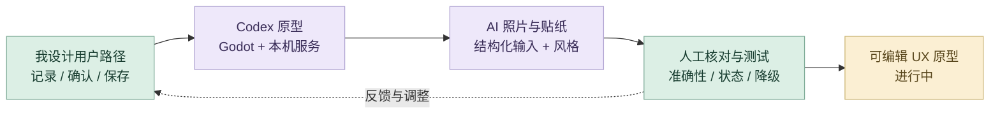
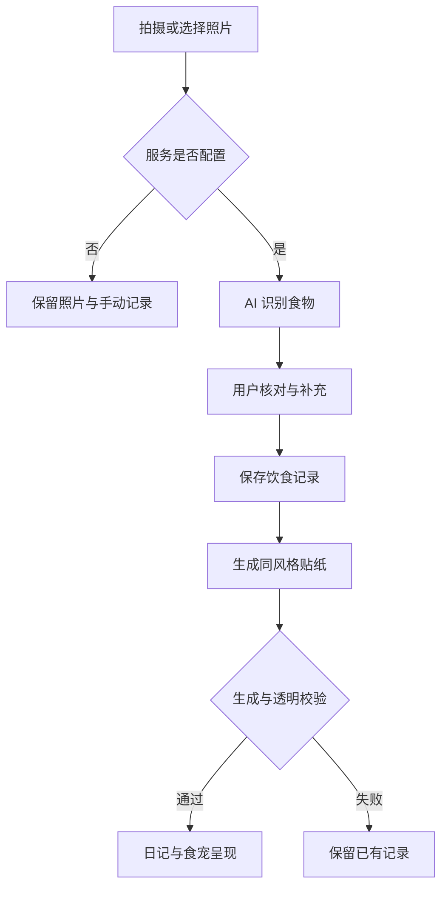

# 饭搭子｜详细 AI 设计工作流

把 AI 放进可理解、可核对、失败后仍能继续的产品流程。AI 负责照片理解与插画生成，我负责用户路径、确认机制、视觉风格和状态体验。项目进行中。

## 策略图

## 工具怎样分工

Figma 组织界面与状态；Codex 连接 Godot 原型、本机 Python 服务与结构化数据；AI 照片流程负责识别与贴纸生成；用户和设计者保留核对与修改入口。

## 1. 围绕真实使用场景发散

从饮食记录、食宠互动与搭子关系展开方案，比较拍照、手动记录和日记反馈如何形成持续使用动机。AI 对话帮助展开方案；产品方向和优先级由我组织。

## 2. 整理路径与约束

将记录、确认、保存、回看和食宠反馈拆成明确步骤。区分照片识别、用户补充与保存记录，并考虑未配置服务、生成失败等状态。

## 3. Figma 建立交互与视觉基准

在 Figma 中组织页面与组件状态，定义插画风格和内容层级。食物贴纸参考已有插画，让生成视觉服务统一的产品体验。

## 4. Codex 搭建 Godot 原型

把用户路径连接成 Godot 页面、状态与可编辑数据，配合本机 Python AI 服务。保留设计图层、场景、脚本和服务代码，让流程能够继续迭代。

## 5. AI 照片识别与人工核对

将照片、补充信息和结构化约束传入识别流程。用户确认食物和份量后再保存，避免把自动识别的结果直接当成最终记录。

## 6. 同风格贴纸与状态验证

以餐食照片为内容、Figma 插画为风格，生成透明 PNG。检查透明通道、图像状态、视觉一致性以及识别与生成等待时的交互反馈。

## 7. 用失败路径推动迭代

未配置密钥时仍可保存照片；生成失败保留已有记录。将实际问题反馈到提示词、数据结构或交互路径，优先保证用户能理解当前状态并继续使用。

## 8. 记录当前原型范围

交付 Godot 原型、本机服务、页面与动效预览。目前真实付费 AI 的端到端质量、外部共享与完整产品体验仍在继续验证。

## 审美与专业质量

| 质量维度 | 我如何控制 | 可查看产出 |
| --- | --- | --- |
| **用户可控** | 核对食物与份量、允许补充信息，再保存记录。 | 确认与修正入口 |
| **视觉精良** | 用已有插画作为风格基准，检查真实透明通道与结果状态。 | 产品内一致的食物贴纸 |
| **体验连续** | 识别或生成失败时保留照片和已有记录，说明当前状态。 | 可继续使用的降级路径 |

## 迭代路线

## 过程证据

[Figma 设计与状态](prototype/design/) · [Godot 页面与状态逻辑](prototype/scripts/) · [本机 AI 服务](prototype/ai_service/) · [实际页面与动效](previews/)

[项目总览](README.md) · [完整 AI 设计方法](https://github.com/Zhiyuan-Xiong/xiongzhiyuan-portfolio/blob/main/docs/AI设计工作流.md)
